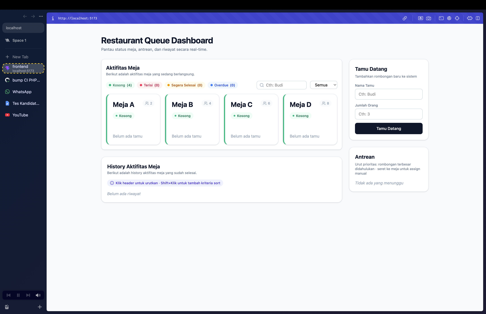
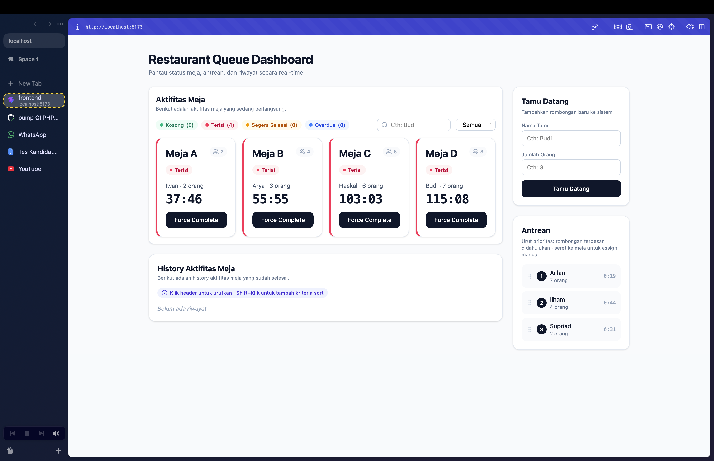
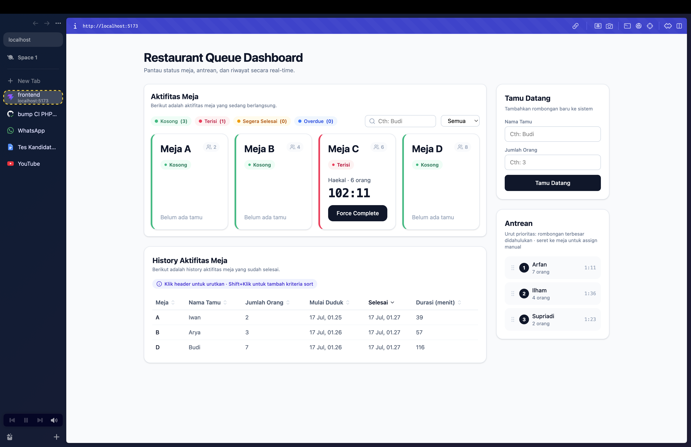
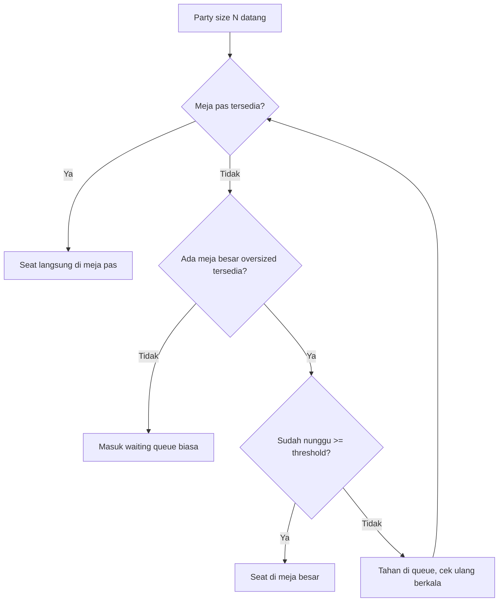

# Restaurant Queue Management System

## Tech Stack

**Backend**
- Laravel 13 (PHP 8.5)
- PostgreSQL 
- Redis (via Predis)
- Pest — testing

**Frontend**
- React 19 + TypeScript + Vite
- TanStack Query
- @dnd-kit
- Tailwind CSS
- Vitest + React Testing Library 

**Infra**
- Docker Compose (Postgres + Redis)
- GitHub Actions — CI/CD

## Screenshot








## Cara Menjalankan Aplikasi

### Prasyarat
- PHP >= 8.4 dan Composer
- Node.js >= 20 dan npm
- Docker & Docker Compose

### 1. Clone & jalankan infrastruktur

```bash
git clone <url-repo-ini>
cd restaurant-fs-test
docker compose up -d
```

Ini menjalankan container `restaurant_postgres` (port 5432) dan `restaurant_redis` (port 6379).

### 2. Setup Backend

```bash
cd backend
composer install
cp .env.example .env
php artisan key:generate
php artisan migrate --seed
php artisan serve
```

`.env.example` sudah dikonfigurasi default untuk connect ke Postgres/Redis dari `docker-compose.yml` di atas (`DB_DATABASE=restaurant`, `DB_USERNAME=restaurant`, `DB_PASSWORD=secret`). `migrate --seed` membuat 4 meja tetap: A(2), B(4), C(6), D(8). Server backend jalan di `http://127.0.0.1:8000`.

### 3. Setup Frontend

```bash
cd frontend
npm install
cp .env.example .env
npm run dev
```

`VITE_API_BASE_URL` di `.env` default mengarah ke `http://127.0.0.1:8000/api`. Dashboard jalan di `http://localhost:5173`.

### 4. Buka dashboard

Buka `http://localhost:5173` — dashboard siap dipakai, tidak perlu API client eksternal (ada form "Tamu Datang" bawaan untuk menambah tamu).

## Struktur Folder

```
restaurant-fs-test/
├── .github/workflows/ci.yml     # pipeline CI (test backend, test frontend, build)
├── docker-compose.yml           # infrastruktur Postgres + Redis untuk development
│
├── backend/                     # Laravel API
│   ├── app/
│   │   ├── Http/
│   │   │   ├── Controllers/Api/  # HTTP layer — terima request, panggil Service, bentuk response
│   │   │   ├── Requests/         # validasi input tiap endpoint sebelum sampai ke controller
│   │   │   └── Resources/        # transformasi model jadi bentuk JSON response yang konsisten
│   │   ├── Models/               # representasi tabel database & relasi antar entity
│   │   └── Services/             # logic bisnis inti (assignment, priority queue, force complete),
│   │                             
│   ├── database/
│   │   ├── migrations/           # definisi skema tabel database
│   │   └── seeders/              # data awal — 4 meja tetap (A/B/C/D)
│   ├── routes/api.php            # daftar endpoint & mapping ke controller
│   └── tests/
│       ├── Unit/                 # test logic murni (manggil Service langsung, tanpa HTTP)
│       └── Feature/               # test endpoint end-to-end (kirim HTTP request, cek response)
│
└── frontend/                    # React dashboard
    └── src/
        ├── api/                  # fungsi pemanggil tiap endpoint backend (axios)
        ├── components/           # komponen UI tiap bagian dashboard (grid meja, antrean, dll)
        ├── hooks/                 # custom hook React Query untuk fetching/mutasi data ke backend
        ├── lib/                   # logic murni non-UI (kalkulasi, validasi, sort, filter) —
        └── types/                 # kontrak TypeScript yang mencerminkan shape response backend
```

## Fitur

### Backend (Bagian 1)
- 4 meja tetap: A(2), B(4), C(6), D(8)
- Table assignment **best-fit**: pilih meja terkecil yang masih cukup (tidak oversize)
- Waktu makan = `(party × 15) + random(5-15)` menit
- Priority queue **non-FIFO**: party terbesar didahulukan, tie-break FIFO untuk size yang sama
- Endpoint wajib: `POST /api/arrive`, `GET /api/status`, `POST /api/serve`, `GET /api/history`
- Endpoint tambahan: `POST /api/assign` (lihat [Asumsi & Keputusan Desain](#asumsi--keputusan-desain))
- Redis caching pada `GET /api/status` (TTL 3 detik + invalidation saat ada mutasi state)
- **18 test** (Pest) — 12 unit + 4 feature khusus fitur ini, plus 2 contoh bawaan Laravel

### Frontend (Bagian 2)
1. Denah restoran interaktif (grid meja)
2. Status warna otomatis: 🟢 hijau (kosong) / 🔴 merah (terisi, sisa >5 menit) / 🟡 kuning (sisa ≤5 menit) / 🔵 biru (overdue)
3. Drag & drop dari antrean ke meja + validasi kapasitas
4. Live countdown timer (`Date.now()`-based)
5. Tombol force complete
6. Queue visualization terurut prioritas
7. History table + **multi-column sort** (klik = 1 kolom, Shift+klik = tambah kolom sebagai tie-breaker)
8. Search by nama & filter by status/party size
- **19 test** (Vitest + React Testing Library)

## Testing

```bash
# Backend
cd backend
./vendor/bin/pest

# Frontend
cd frontend
npm run test
```

## CI/CD

`.github/workflows/ci.yml` jalan otomatis tiap push/PR ke `main`, 3 job:
1. **backend-tests** — Pest, terisolasi penuh (SQLite in-memory + cache array via override `phpunit.xml`), tidak butuh service container Postgres/Redis
2. **frontend-tests** — Vitest
3. **frontend-build** — `vite build`, baru jalan setelah `frontend-tests` lolos (`needs:`)

Deploy staging sengaja tidak diimplementasikan (di luar scope waktu pengerjaan).

## Asumsi & Keputusan Desain

**Aturan warna status meja** tidak dirinci di requirement, jadi didefinisikan sendiri: hijau=kosong, merah=terisi dengan sisa waktu >5 menit, kuning=sisa ≤5 menit, biru=sudah lewat estimasi (overdue, perlu perhatian staff). Threshold 5 menit adalah konstanta yang mudah diubah (`NEARING_COMPLETION_MS` di `lib/tableStatus.ts`).

**Redis** digunakan untuk caching `GET /api/status` — endpoint ini di-poll frontend secara berkala untuk update live, jadi cache dengan TTL pendek (3 detik) mengurangi beban database saat idle, sementara invalidation manual (`Cache::forget`) di setiap titik mutasi state (party diseat, meja dibebaskan) menjaga data tetap akurat begitu ada perubahan, bukan menunggu TTL habis.

**Endpoint tambahan `POST /api/assign`** ditambahkan di luar 4 endpoint wajib, karena fitur drag & drop (Bagian 2) butuh kemampuan menempatkan party spesifik ke meja spesifik secara manual — sesuatu yang tidak bisa dilakukan lewat `/arrive` (yang selalu auto best-fit). Endpoint ini reuse method assignment yang sama (`seatPartyAtTable`) dengan `/arrive`, cuma triggernya manual.

**Form "Tamu Datang" di frontend** ditambahkan meski bukan salah satu dari 8 fitur eksplisit, supaya dashboard bisa dipakai end-to-end dari browser tanpa perlu API client eksternal (Insomnia/Postman) untuk mendemokan seluruh alur.

## Tantangan yang Dihadapi

**Auto re-assignment vs realita waktu makan.** Desain awal: `force complete` otomatis mencari & menempatkan waiting party yang cocok ke meja yang baru kosong, langsung menghitung `seated_at = now()`. Setelah dipikir ulang, ini tidak realistis — di dunia nyata ada jeda antara meja kosong dan tamu benar-benar duduk (staff memanggil, tamu berjalan ke meja). Auto re-assign membuat countdown makan mulai berjalan sebelum tamu benar-benar sampai, "mencuri" sebagian waktu makan mereka tanpa mereka sadari. **Solusi**: `force complete` sekarang hanya membebaskan meja; drag & drop manual jadi satu-satunya mekanisme resmi untuk menempatkan tamu dari antrean ke meja, sehingga timer mulai tepat saat admin mengonfirmasi tamu benar-benar sudah duduk.

**Drag & drop auto-fill.** Konsekuensi dari poin di atas: `/arrive` sendiri tetap auto-seat instan kalau ada meja kosong saat tamu datang (itu realistis — bukan re-assignment dari antrean lama). Karena logic best-fit di `/arrive` sudah cukup agresif, kombinasi "meja kosong + party yang pas di antrean" nyaris selalu langsung terselesaikan otomatis, jarang menyisakan celah untuk drag & drop manual di pemakaian normal. Untuk membuktikan behavior drag & drop (termasuk validasi kapasitas), pengujian happy-path dilakukan dengan menyisipkan data waiting party langsung lewat `tinker` (bypass auto-assign), meniru skenario di mana admin perlu override manual.

**Eloquent relation caching.** Beberapa kali `$table->currentSeating` mengembalikan data basi setelah `update()`, karena Eloquent meng-cache hasil relasi pertama kali diakses pada object yang sama. Solusinya memanggil `->refresh()` sebelum membaca ulang relasi tersebut di test maupun logic terkait.

**Cache invalidation harus dipasang di semua titik mutasi, bukan cuma "happy path".** Awalnya invalidation cache `/status` cuma dipasang saat party berhasil diseat — kasus party masuk waiting queue (gagal diseat) terlewat, menyebabkan delay hingga TTL habis sebelum antrean baru muncul di frontend. Diperbaiki dengan memindahkan invalidation ke titik paling awal (segera setelah record `Party` dibuat), menutup kedua jalur sekaligus.

## Bagian 3 — Bonus: Optimasi Revenue

**Masalah**: party kecil (misal 2 orang) datang saat hanya meja besar (kapasitas 8) yang kosong. Kalau langsung diseat di situ, kapasitas 6 kursi "terbuang" — meja besar itu jadi tidak tersedia untuk rombongan besar yang mungkin datang sebentar lagi, padahal cuma dipakai 2 orang. Tapi kalau dipaksa nunggu meja kecil kosong, party itu bisa nunggu terlalu lama dan komplain/pergi.

### Strategi: threshold-based holding

Alih-alih langsung menempatkan party kecil ke meja oversized begitu itu satu-satunya opsi, tahan mereka di antrean untuk jangka waktu pendek (misal maksimal 10-15 menit), berharap meja yang ukurannya lebih pas keburu kosong duluan. Kalau threshold itu terlewati tanpa ada meja pas yang kosong, baru "menyerah" dan tempatkan mereka di meja besar — mencegah wait time jadi tidak terbatas.

```
function assignTable(party):
    bestFit = findSmallestAvailableTable(party.size)

    if bestFit exists:
        seat(party, bestFit)
        return

    oversizedTable = findSmallestAvailableTable(party.size, allowOversize = true)

    if oversizedTable does not exist:
        addToQueue(party)          # tidak ada meja sama sekali, tunggu wajar
        return

    waitTime = now - party.arrivedAt

    if waitTime >= MAX_HOLD_THRESHOLD:      # misal 10-15 menit
        seat(party, oversizedTable)          # customer experience menang
    else:
        addToQueue(party)                    # tahan dulu, coba lagi nanti
        scheduleRecheck(party, delay = RECHECK_INTERVAL)
```



### Trade-off

| Aspek | Tahan (holding) | Langsung seat di meja besar |
|---|---|---|
| **Revenue** | Lebih baik — meja besar tetap tersedia untuk rombongan besar yang lebih menguntungkan | Berpotensi rugi — kapasitas besar terpakai buat party kecil |
| **Customer experience** | Berisiko — party kecil menunggu meski (secara visual, kalau UI transparan) ada meja "kosong" kelihatan | Lebih baik — langsung dilayani, tidak ada keluhan menunggu |
| **Kompleksitas implementasi** | Butuh mekanisme threshold + re-check berkala (job terjadwal atau re-evaluasi tiap ada perubahan state) | Sederhana — pakai best-fit apa adanya seperti implementasi saat ini |

**Mitigasi risiko customer experience**: threshold dibatasi ketat (jangan sampai terasa "dipaksa nunggu tanpa alasan"), dan idealnya dikomunikasikan secara transparan ke tamu (estimasi waktu tunggu) supaya ekspektasi terkelola, bukan disembunyikan begitu saja.

Implementasi saat ini **belum** menerapkan strategi ini (best-fit assignment langsung, tanpa holding period) — ini murni analisis trade-off sesuai permintaan bonus, bukan behavior yang sudah dibangun di kode.
